.. py:currentmodule:: pydlm
	      
Google data science post example
================================

We use the example from the `Google data science post <http://www.unofficialgoogledatascience.com/2017/07/fitting-bayesiean-structural-time-series.html>`_ to showcase `pydlm`. The code and data is placed under `examples/unemployment_insurance/...`. The data is the weekly counts of initial claims for unemployment during 2004 - 2012 and is available from the R package `bsts` (which is a popular R package for time series modeling). The raw data is shown below (left)

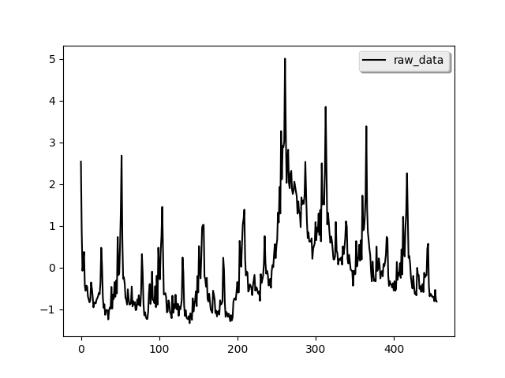
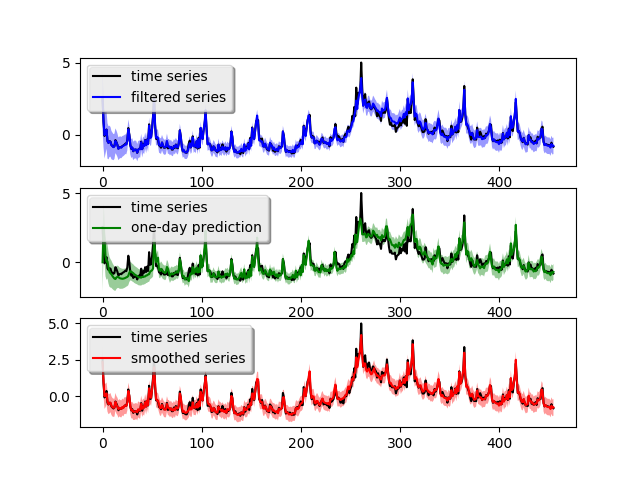

We can see strong annual pattern and some local trend from the data.

A simple model
--------------
Following the post, we first build a simple model with only local
linear :class:`trend` and :class:`seasonality` component::
  
  from pydlm import dlm, trend, seasonality
  # A linear trend
  linear_trend = trend(degree=1, discount=0.95, name='linear_trend', w=10)
  # A seasonality
  seasonal52 = seasonality(period=52, discount=0.99, name='seasonal52', w=10)
  # Build a simple dlm
  simple_dlm = dlm(time_series) + linear_trend + seasonal52

In the actual code, the time series data is scored in the variable
`time_series`. `degree=1` indicates the trend is a linear (2 stands
for quadratic) and `period=52` means the seasonality has a periodicy
of 52. Since the seasonality is generally more stable, we set its
discount factor to 0.99. For local linear trend, we use 0.95 to allow
for some flexibility. `w=10` is the prior guess on the variance of
each component, the larger number the more uncertain. For actual
meaning of these parameters, please refer to the `user manual <http://pydlm.github.io/pydlm_user_guide.html>`_. After the model built, we can fit the model and plot the result (shown above, right figure)::

  # Fit the model
  simple_dlm.fit()
  # Plot the fitted results
  simple_dlm.turnOff('data points')
  simple_dlm.plot()

The blue curve is the forward filtering result, the green curve is the one-day ahead prediction and the red curve is the backward smoothed result. The light-colored ribbon around the curve is the confidence interval (you might need to zoom-in to see it). The one-day ahead prediction shows this simple model captures the time series somewhat good but loses accuracy around the peak crisis at Week 280 (which is between year 2008 - 2009). The one-day-ahead mean squared prediction error is **0.173** which can be obtaied by calling::

  simple_dlm.getMSE()

We can decompose the time series into each of its components::

  # Plot each component (attribute the time series to each component)
  simple_dlm.turnOff('predict plot')
  simple_dlm.turnOff('filtered plot')
  simple_dlm.plot('linear_trend')
  simple_dlm.plot('seasonal52')

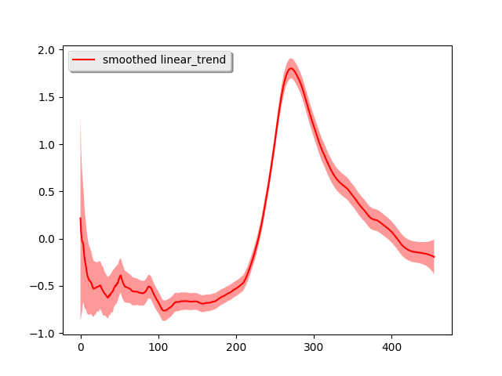
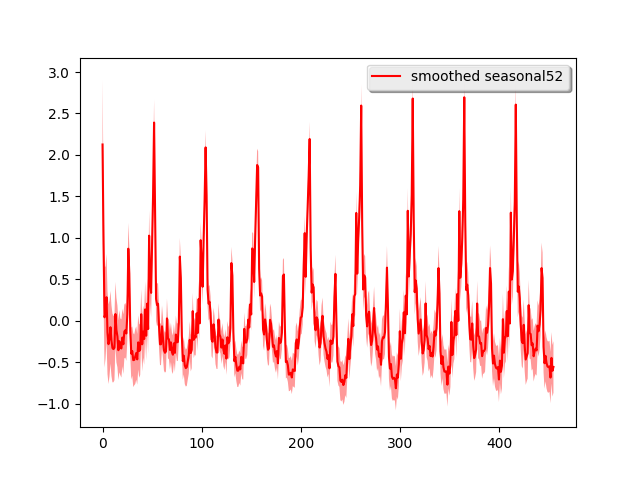

Most of the time series shape is attributed to the local linear trend
and the strong seasonality pattern is easily seen. To further verify
the performance, we use this simple model for long-term
forecasting. In particular, we use the previous **351 week** 's data to
forecast the next **200 weeks** and the previous **251 week** 's data
to forecast the next **200 weeks**. We lay the predicted results on
top of the real data::

  # Plot the prediction give the first 351 weeks and forcast the next 200 weeks.
  simple_dlm.plotPredictN(date=350, N=200)
  # Plot the prediction give the first 251 weeks and forcast the next 200 weeks.
  simple_dlm.plotPredictN(date=250, N=200)

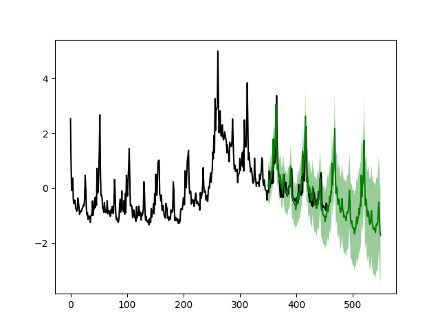
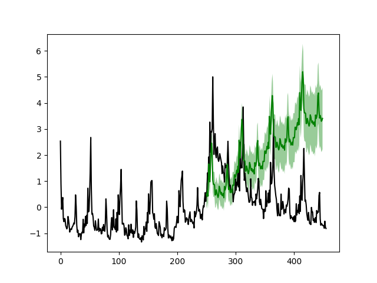

From the figure we see that after the crisis peak around 2008 - 2009 (Week 280), the simple model can accurately forecast the next 200 weeks (left figure) given the first 351 weeks. However, the model fails to capture the change near the peak if the forecasting start before Week 280 (right figure).

Dynamic linear regression
-------------------------
Now we build a more sophiscated model with extra variables in the data
file. The extra variables are stored in the variable `features` in the
actual code. To build the dynamic linear regression model, we simply
add a new component::

  # Build a dynamic regression model
  from pydlm import dynamic
  regressor10 = dynamic(features=features, discount=1.0, name='regressor10', w=10)
  drm = dlm(time_series) + linear_trend + seasonal52 + regressor10
  drm.fit()
  drm.getMSE()

  # Plot the fitted results
  drm.turnOff('data points')
  drm.plot()

:class:`dynamic` is the component for modeling dynamically changing predictors, which accepts :attr:`features` as its argument. The above code plots the fitted result (top left).

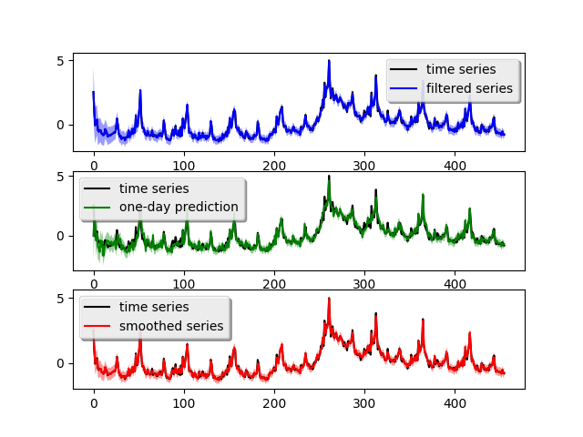
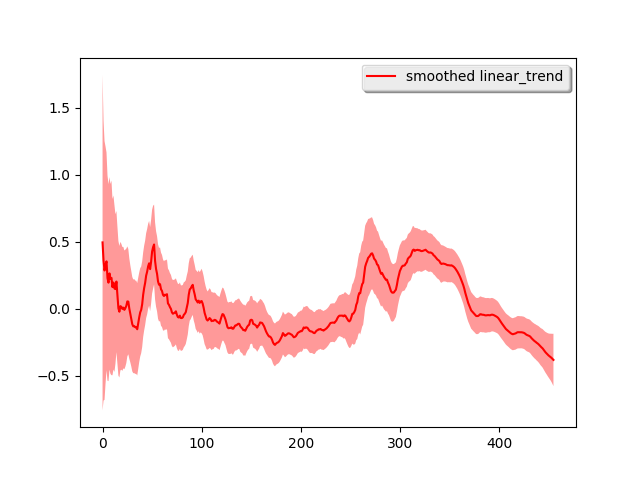
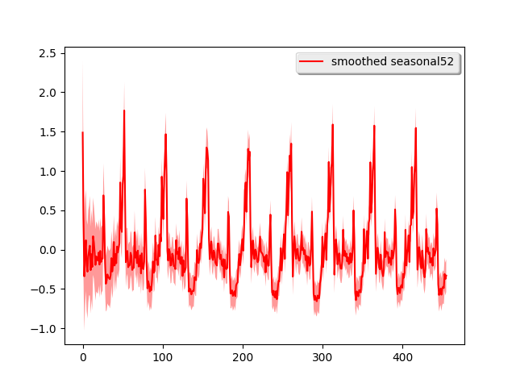
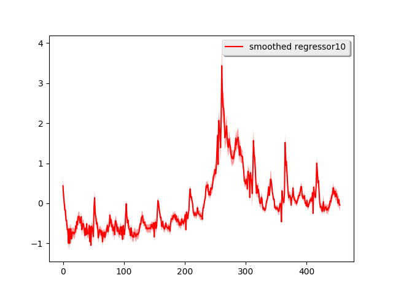

The one-day ahead prediction looks much better than the simple model,
particularly around the crisis peak. The mean prediction error is
**0.099** which is a 100% improvement over the simple
model. Similarly, we also decompose the time series into the three
components::

  drm.turnOff('predict plot')
  drm.turnOff('filtered plot')
  drm.plot('linear_trend')
  drm.plot('seasonal52')
  drm.plot('regressor10')

This time, the shape of the time series is mostly attributed to the
regressor and the linear trend looks more linear. If we do long-term
forecasting again, i.e., use the previous **301 week** 's data to
forecast the next **150 weeks** and the previous **251 week** 's data
to forecast the next **200 weeks**::

  drm.plotPredictN(date=300, N=150)
  drm.plotPredictN(date=250, N=200)

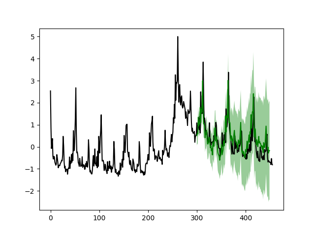
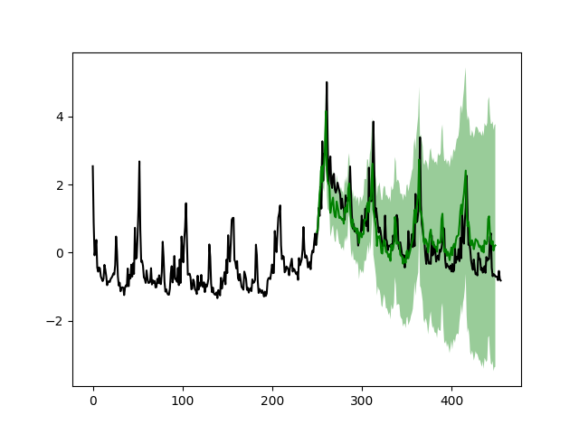

The results look much better compared to the simple model
