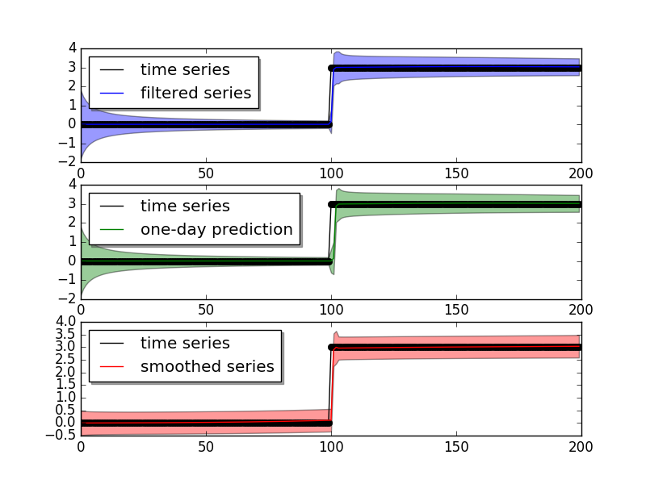
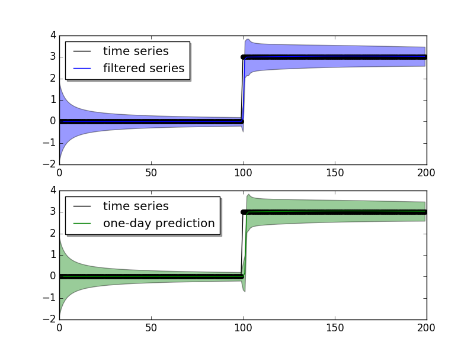
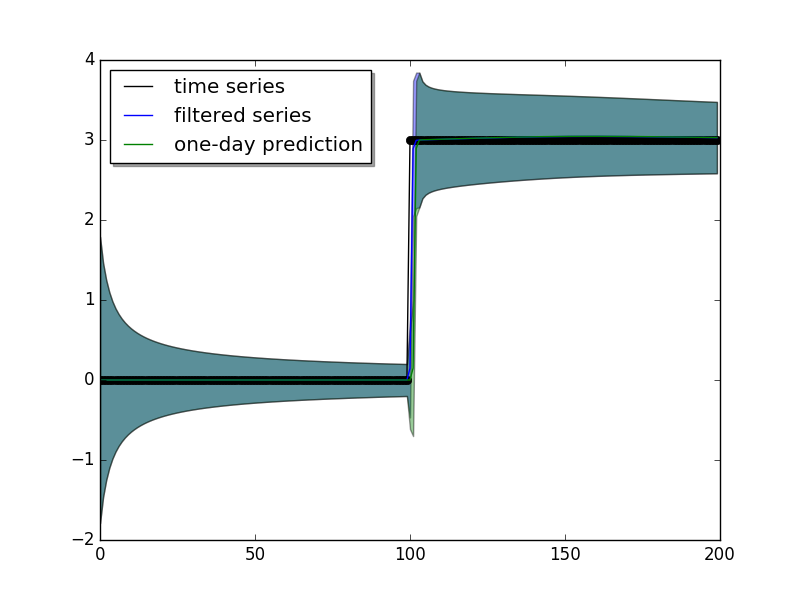
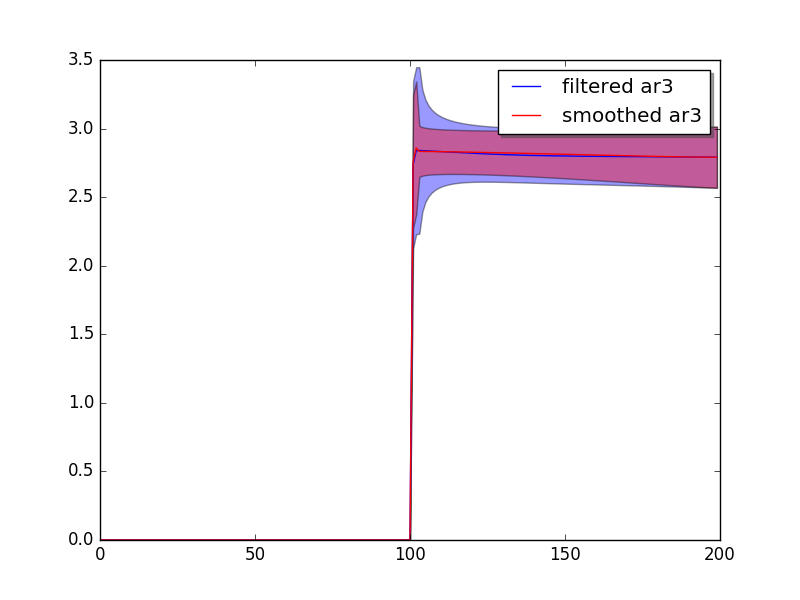
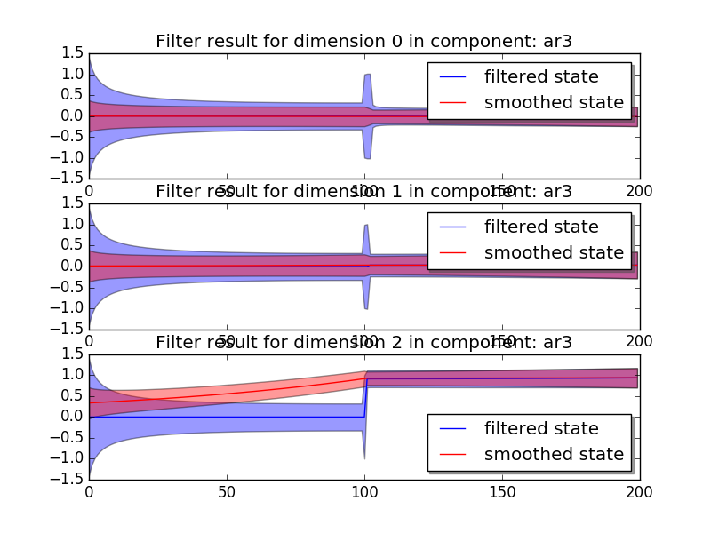
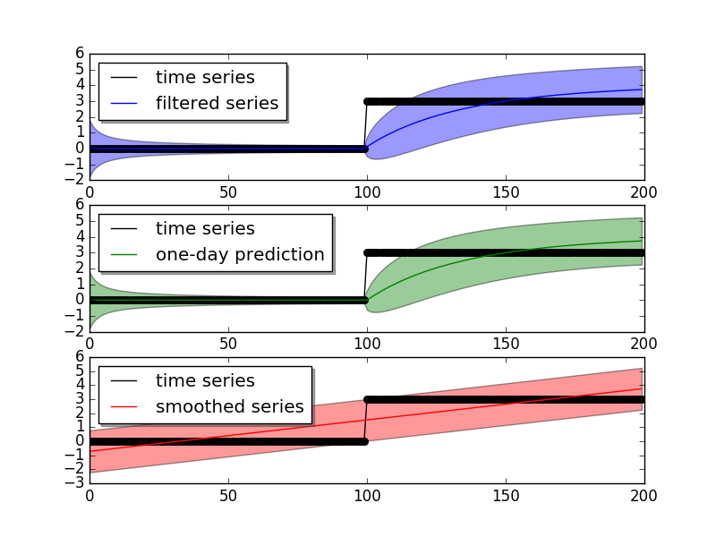
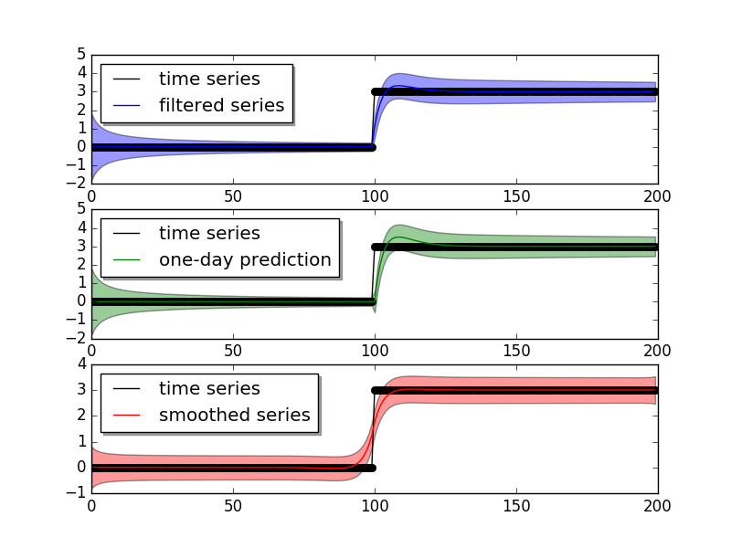

.. module:: pydlm

`PyDLM <https://github.com/wwrechard/PyDLM>`_
=======================================================

Welcome to `PyDLM <https://github.com/wwrechard/PyDLM>`_, a flexible,
user-friendly and rich functionality
time series modeling library for python. This package implementes the
Bayesian dynamic linear model (Harrison and West, 1999) for time
series data analysis. Modeling and fitting is simple and easy with :mod:`pydlm`.
Complex models can be constructed via simple operations::

  # import dlm and its modeling components
  from pydlm import dlm, trend, seasonality, dynamic, autoReg, longSeason
  # randomly generate data
  data = [0] * 100 + [3] * 100
  # construct the base
  myDLM = dlm(data)
  # adding model components
  # add a first-order trend (linear trending) with prior covariance 1.0
  myDLM = myDLM + trend(1, name='lineTrend', w=1.0)
  # add a 7 day seasonality with prior covariance 1.0
  myDLM = myDLM + seasonality(7, name='7day', w=1.0)
  # add a 3 step auto regression
  myDLM = myDLM + autoReg(degree=3, data=data, name='ar3', w=1.0) 
  # show the added components
  myDLM.ls()
  # delete unwanted component
  myDLM.delete('7day')
  myDLM.ls()

Users can then analyze the data with the constructed model::

  # fit forward filter
  myDLM.fitForwardFilter()
  # fit backward smoother
  myDLM.fitBackwardSmoother()

and plot the results easily::

  # plot the results
  myDLM.plot()
  # plot only the filtered results
  myDLM.turnOff('smoothed plot')
  myDLM.plot()
  # plot in one figure
  myDLM.turnOff('multiple plots')
  myDLM.plot()

The three images show

User can also plot the mean of a component (the time series value that
attributed to this component)::

  # plot the component mean of 'ar3'
  myDLM.turnOn('smoothed plot')
  myDLM.turnOff('predict')
  myDLM.plot(name='ar3')

and also the latent states for a given component::

  # plot the latent states of the 'ar3'
  myDLM.plotCoef(name='ar3')

which result in

The 'ar3' has three latent states (`today - 3`, `today - 2`, `today - 1`),
and the states are aligned in the order fo [`today - 3`, `today - 2`,
`today - 1`], which means the current model attributes a lot of weight
to the `today - 1` latent state.

If users are unsatisfied with the model results, they can simply
reconstruct the model and refit::

  myDLM = myDLM + seasonality(4)
  myDLM.ls()
  myDLM.fit()

`pydlm` supports missing observations::

  data = [1, 0, 0, 1, 0, 0, None, 0, 1, None, None, 0, 0]
  myDLM = dlm(data) + trend(1, w=1.0)
  myDLM.fit()  # fit() will fit both forward filter and backward smoother

It also includes the discounting factor, which can be used to control how rapidly the model should adapt to the new data::

  data = [0] * 100 + [3] * 100
  myDLM = dlm(data) + trend(1, discount=1.0, w=1.0)
  myDLM.fit()
  myDLM.plot()
  
  myDLM.delete('trend')
  myDLM = myDLM + trend(1, discount=0.8, w=1.0)
  myDLM.fit()
  myDLM.plot()
  
The two different settings give different adaptiveness

The discounting factor can be auto-tuned by the :class:`modelTuner`
provided by the package::

  from pydlm import modelTuner
  myTuner = modelTuner(method='gradient_descent', loss='mse')
  tunedDLM = myTuner.tune(myDLM, maxit=100)

and users can get the MSE of each model for performance comparison::

  myDLM_mse = myDLM.getMSE()
  tunedDLM.fit()
  tunedDLM_mse = tunedDLM.getMSE()

The filtered results and latent states can be retrieved easily::

  # get the filtered and smoothed results
  filteredMean = myDLM.getMean(filterType='forwardFilter')
  smoothedMean = myDLM.getMean(filterType='backwardSmoother')
  filteredVar = myDLM.getVar(filterType='forwardFilter')
  smoothedVar = myDLM.getVar(filterType='backwardSmoother')

  filteredCI = myDLM.getInterval(filterType='forwardFilter')
  smoothedCI = myDLM.getInterval(filterType='backwardSmoother')

  # get the residual time series
  residual = myDLM.getResidual(filterType='backwardSmoother')

  # get the filtered and smoothed mean for a given component
  filteredTrend = myDLM.getMean(filterType='forwardFilter', name='lineTrend')
  smoothedTrend = myDLM.getMean(filterType='backwardSmoother', name='lineTrend')

  # get the latent states
  allStates = myDLM.getLatentState(filterType='forwardFilter')
  trendStates = myDLM.getLatentState(filterType='forwardFilter', name='lineTrend')

For online updates::

  myDLM = dlm([]) + trend(1) + seasonality(7)
  for t in range(0, len(data)):
  ...     myDLM.append([data[t]])
  ...     myDLM.fitForwardFilter()
  filteredObs = myDLM.getFilteredObs()

Documentation
=============
.. toctree::
      :maxdepth: 2

      installation
      example
      pydlm_user_guide
      discounting
      class_ref
