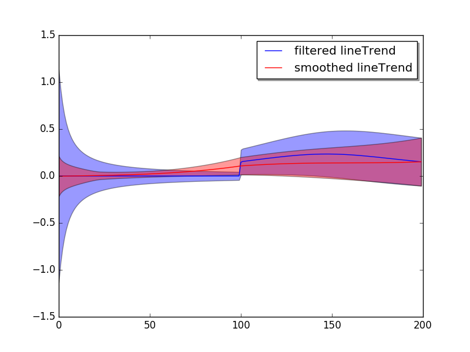

=======================================================
`PyDLM <https://github.com/wwrechard/PyDLM>`_
=======================================================

Welcome to `PyDLM <https://github.com/wwrechard/PyDLM>`_, a flexible,
user-friendly and rich functionality
time series modeling library for python. This package implementes the
Bayesian dynamic linear model (Harrison and West, 1999) for time
series data analysis. Modeling and fitting is simple and easy with :mod:`pydlm`.
Complex models can be constructed via simple operations::

  >>> #import dlm and its modeling components
  >>> from pydlm import dlm, trend, seasonality, dynamic, autoReg, longSeason
  >>>
  >>> #randomly generate data
  >>> data = [0] * 100 + [3] * 100
  >>>
  >>> #construct the base
  >>> myDLM = dlm(data)
  >>>
  >>> #adding model components
  >>> myDLM = myDLM + trend(2, name='lineTrend') # add a second-order trend (linear trending)
  >>> myDLM = myDLM + seasonality(7, name='7day') # add a 7 day seasonality
  >>> myDLM = myDLM + autoReg(degree=3, data=data, name='ar3') # add a 3 step auto regression
  >>>
  >>> #show the added components
  >>> myDLM.ls()
  >>>
  >>> #delete unwanted component
  >>> myDLM.delete('7day')
  >>> myDLM.ls()

Users can then analyze the data with the constructed model::

  >>> #fit forward filter
  >>> myDLM.fitForwardFilter()
  >>>
  >>> #fit backward smoother
  >>> myDLM.fitBackwardSmoother()

and plot the results easily::

  >>> #plot the results
  >>> myDLM.plot()
  >>>
  >>> #plot only the filtered results
  >>> myDLM.turnOff('smoothed plot')
  >>> myDLM.plot()
  >>>
  >>> #plot in one figure
  >>> myDLM.turnOff('multiple plots')
  >>> myDLM.plot()

The three images show

.. image:: ./img/intro_plot_all.png
	   :width: 33%
.. image:: ./img/intro_plot_wo_smooth.png
	   :width: 33%
.. image:: ./img/intro_plot_in_1.png
	   :width: 33%

User can also plot the mean of a component (the time series value that
attributed to this component)::

  >>> # plot the component mean of 'lineTrend'
  >>> myDLM.turnOn('smoothed plot')
  >>> myDLM.turnOff('predict')
  >>> myDLM.plot(name='lineTrend')

and also the latent states for a given component::

  >>> # plot the latent states of the 'ar3'
  >>> myDLM.plotCoef(name='ar3')

which result in

.. image:: ./img/intro_plot_state.png
	   :width: 49%

If users are unsatisfied with the model results, they can simply reconstruct the model and refit::

  >>> myDLM = myDLM + seasonality(4)
  >>> myDLM.ls()
  >>> myDLM.fit()

`pydlm` supports missing observations::

  >>> data = [1, 0, 0, 1, 0, 0, None, 0, 1, None, None, 0, 0]
  >>> myDLM = dlm(data) + trend(2)
  >>> myDLM.fit() #fit() will fit both forward filter and backward smoother

It also includes the discounting factor, which can be used to control how rapidly the model should adapt to the new data::

  >>> data = [0] * 100 + [3] * 100
  >>> myDLM = dlm(data) + trend(2, discount = 1.0)
  >>> myDLM.fit()
  >>> myDLM.plot()
  >>>
  >>> myDLM.delete('trend')
  >>> myDLM = myDLM + trend(2, discount = 0.9)
  >>> myDLM.fit()
  >>> myDLM.plot()
  >>>

The two different settings give different adaptiveness

.. image:: ./img/intro_discount_1.png
	   :width: 49%
.. image:: ./img/intro_discount_09.png
	   :width: 49%

The filtered results and latent states can be retrieved easily::

  >>> # get the filtered and smoothed results
  >>> filteredMean = myDLM.getMean(filterType='forwardFilter')
  >>> smoothedMean = myDLM.getMean(filterType='backwardSmoother')
  >>>
  >>> filteredVar = myDLM.getVar(filterType='forwardFilter')
  >>> smoothedVar = myDLM.getVar(filterType='backwardSmoother')
  >>>
  >>> filteredCI = myDLM.getInterval(filterType='forwardFilter')
  >>> smoothedCI = myDLM.getInterval(filterType='backwardSmoother')
  >>>
  >>> # get the filtered and smoothed mean for a given component
  >>> filteredTrend = myDLM.getMean(filterType='forwardFilter', name='lineTrend')
  >>> smoothedTrend = myDLM.getMean(filterType='backwardSmoother', name='lineTrend')
  >>>
  >>> # get the latent states
  >>> allStates = myDLM.getLatentState(filterType='forwardFilter')
  >>> trendStates = myDLM.getLatentState(filterType='forwardFilter', name='lineTrend')

For online updates::

  >>> myDLM = dlm([]) + trend(2) + seasonality(7)
  >>> for t in range(0, len(data)):
  ...     myDLM.append([data[t]])
  ...     myDLM.fitForwardFilter()
  >>> filteredObs = myDLM.getFilteredObs()

------------
Installation
------------
You can now get the package from `PyPI`::

  $ pip install pydlm

You can also get the latest from `github
<https://github.com/wwrechard/PyDLM>`_::

      $ git clone git@github.com:wwrechard/pydlm.git pydlm
      $ cd pydlm
      $ sudo python setup.py install

:mod:`pydlm` depends on the following modules,

* :mod:`numpy`      (for core functionality)
* :mod:`matplotlib` (for plotting results)
* :mod:`Sphinx`     (for generating documentation)
* :mod:`unittest`   (for tests)

----------------
A simple example
----------------
.. include:: example.rst

-------------------------------------
Dynamic linear models --- user manual
-------------------------------------

.. include:: pydlm_user_guide.rst

---------------------
The discouting factor
---------------------

.. include:: discounting.rst

---------------
Class Reference
---------------

.. include:: class_ref.rst
