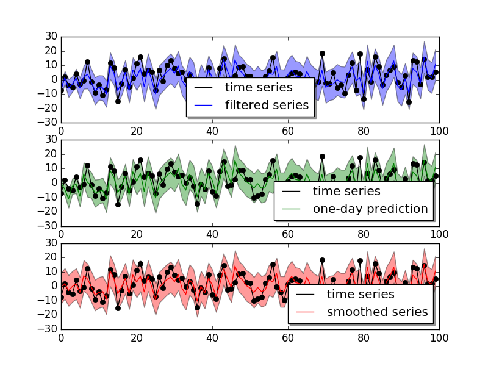
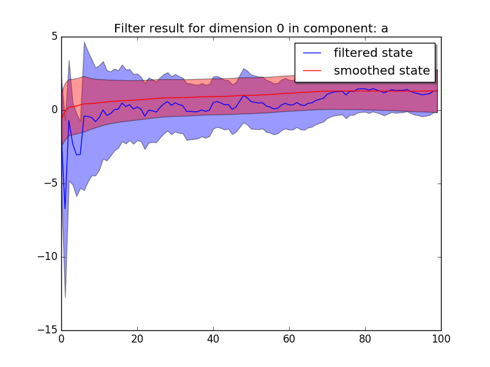
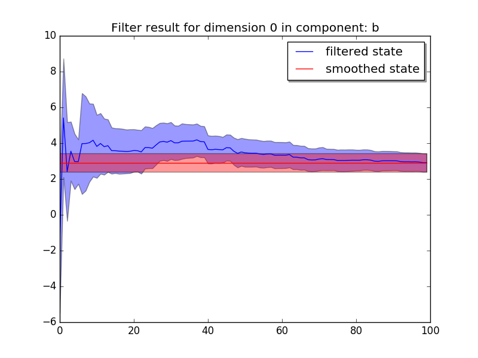

.. py:currentmodule:: pydlm
	      
A simple example
================

In this section, we give a simple example on linear regression to
illustrate how to use the `pydlm` for analyzing data. The data is
generated via the following process::

  import numpy as np
  n = 100
  a = 1.0 + np.random.normal(0, 5, n) # the intercept
  x = np.random.normal(0, 2, n) # the control variable
  b = 3.0 # the coefficient
  y = a + b * x

In the above code, `a` is the baseline random walk centered around 1.0
and `b` is the coefficient for a control variable. The goal is to
decompose `y` and learn the value of `a` and `b`. We first build the
model::

  from pydlm import dlm, trend, dynamic
  mydlm = dlm(y)
  mydlm = mydlm + trend(degree=0, discount=0.98, name='a', w=10.0)
  mydlm = mydlm + dynamic(features=[[v] for v in x], discount=1, name='b', w=10.0)

In the model, we add two components :class:`trend` and
:class:`dynamic`. The trend `a` is one of the systematical components
that used to characterize a time series, and trend is particularly
suitable for this case. `degree=0` indicates this is a constant and
`degree=1` indicates a line and so on so forth. It has a 
discount factor of 0.98 as we believe the baseline can gradually shift
overtime and we specify a prior covariance with 10.0 on the
diagonal. The dynamic component `b` is modeling the regression
component. We specify its discounting factor to be 1.0 since we
believe `b` should be a constant. The :class:`dynamic` class only accepts 2-d
list for feature arugment (since the control variable could be
multi-dimensional). Thus, we change `x` to 2d list. In addition, we
believe these two processes `a` and `b` evolve independently and set
(This is currently the default assumption, so actually no need to set)::

  mydlm.evolveMode('independent')

This can also be set to 'dependent' if the computation efficiency is a
concern. The default prior on the covariance of each component is a
diagonal matrix with 1e7 on the diagonal, we changed this value in
building the component (more details please refer to the user manual).
The prior on the observational noise (default to 1.0) can be set by::

  mydlm.noisePrior(2.0)

We then fit the model by typing::

  mydlm.fit()

After some information printed on the screen, we are done (yah! :p)
and we can fetch and examine our results. We
first visualize the fitted results and see how well the model fits the
data::

  mydlm.plot()

The result shows

It looks pretty nice for the one-day ahead prediction accuracy.
We can also plot the two coefficients `a` and `b` and see how they
change when more data is added::

  mydlm.turnOff('predict')
  mydlm.plotCoef(name='a')
  mydlm.plotCoef(name='b')

and we have

We see that the latent state of `b` quickly shift from 0 (which is our
initial guess on the parameter) to around 3.0 and the confidence
interval explodes and then narrows down as more data is added.

Once we are happy about the result, we can fetch the results:::

  # get the smoothed results
  smoothedResult = mydlm.getMean(filterType='backwardSmoother')
  smoothedVar = mydlm.getVar(filterType='backwardSmoother')
  smoothedCI = mydlm.getInterval(filterType='backwardSmoother')

  # get the coefficients
  coef_a = mydlm.getLatentState(filterType='backwardSmoother', name='a')
  coef_a_var = mydlm.getLatentCov(filterType='backwardSmoother', name='a')
  coef_b = mydlm.getLatentState(filterType='backwardSmoother', name='b')
  coef_b_var = mydlm.getLatentCov(filterType='backwardSmoother', name='b')

We can then use `coef_a` and `coef_b` for further analysis. If we
want to predict the future observation based on the current data, we
can do::

  # prepare the new feature
  newData1 = {'b': [5]}
  # one-day ahead prediction from the last day
  (predictMean, predictVar) = mydlm.predict(date=mydlm.n-1, featureDict=newData1)

  # continue predicting for next day
  newData2 = {'b': [4]}
  (predictMean, predictVar) = mydlm.continuePredict(featureDict=newData2)

  # continue predicting for the third day
  newData3 = {'b': [3]}
  (predictMean, predictVar) = mydlm.continuePredict(featureDict=newData3)

or using the simpler :func:`dlm.predictN`::

  newData = {'b': [[5], [4], [3]]}
  (predictMean, predictVar) = mydlm.predictN(N=3, date=mydlm.n-1, featureDict=newData)
